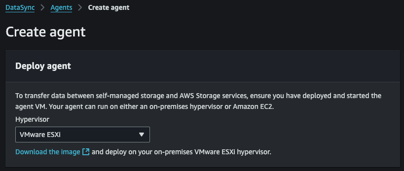
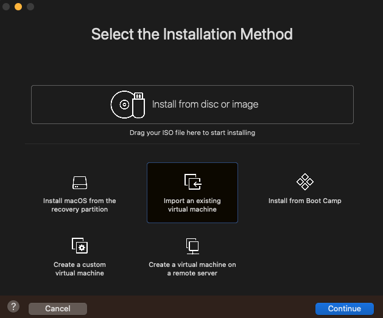
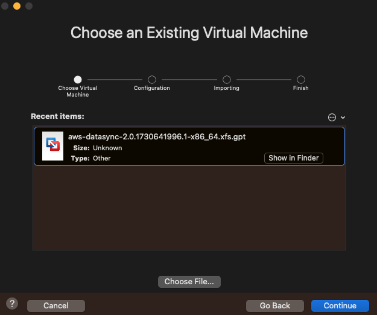

# AWS Datasync from On Prem to S3

Demonstrate capability to move data from on-premise to AWS S3 by using [AWS DataSync](https://docs.aws.amazon.com/datasync/latest/userguide/what-is-datasync.html)

# VM Setup
I am using my local MacBook Pro to simulate an on-prem server.
- [x] Install VMWare's [Fusion Pro](https://blogs.vmware.com/teamfusion/2024/05/fusion-pro-now-available-free-for-personal-use.html) product
- [x] Setup your VM using the provided VMWare ESXi image from AWS Datasync 
- [x] In VMWare Fusion, create a new VM by selecting `Import an Existing Virtual Machine`  
- [x] Select VMWare ESXi image you downloaded previously 
- 

# SMB Setup
- [x] Turn your Mac into an [SMB File Server](https://www.youtube.com/watch?v=FvVZN2WcPhc)
